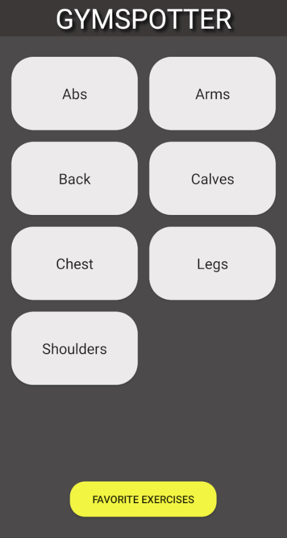
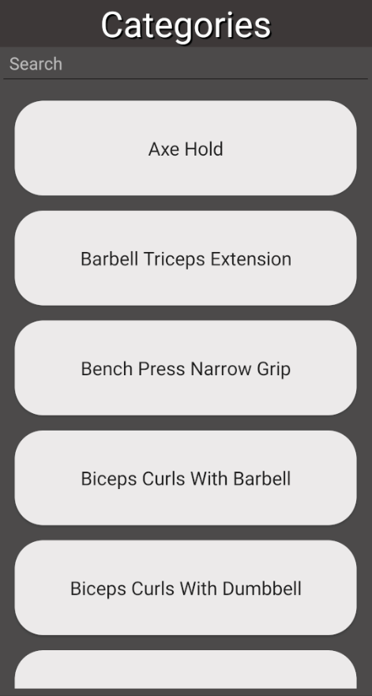
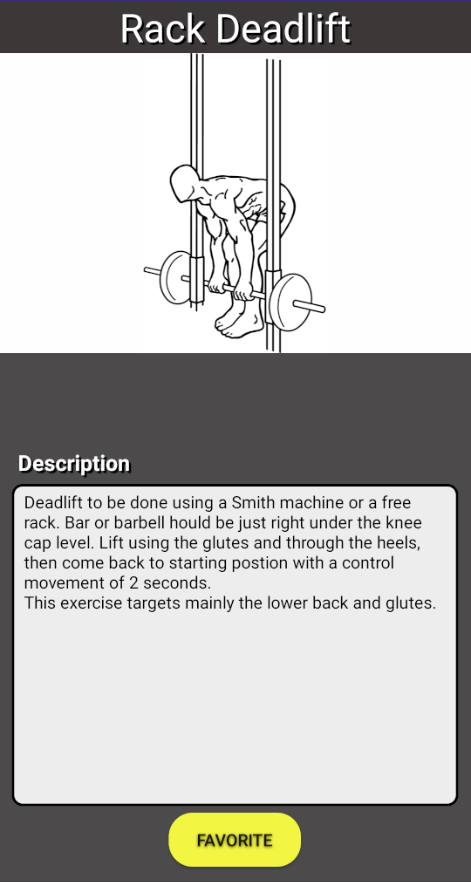
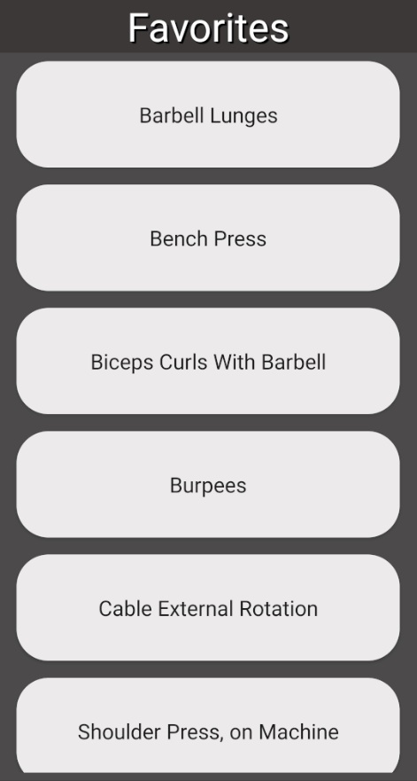
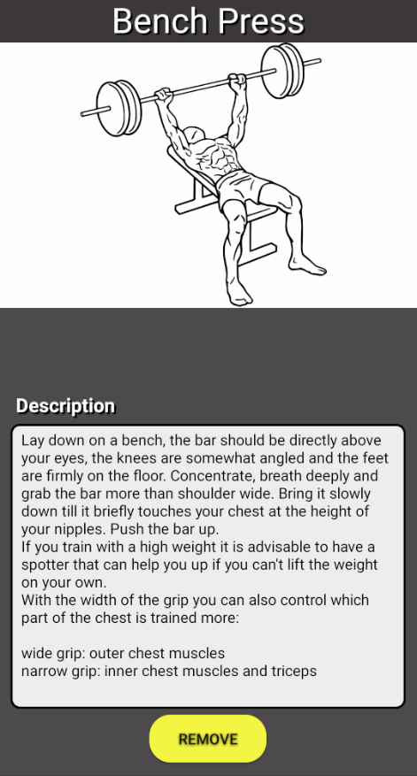

# GymSpotter

| Name   | Jani Koski                                                                                                                                                       |
| ------ | ---------------------------------------------------------------------------------------------------------------------------------------------------------------- |
| Topic  | Mobile application where user can search different exercises sorted by category. User can use search bar to filter results. Exercises can be added to favorites. |
| Target | Android/Kotlin                                                                                                                                                   |

---

# Release 1: 2021-05-12 features

- User can add exercise day.
- User can display different muscle categories.

## Known bugs

- Added exercise days are not saved. Changes are lost after app is closed.
- When fetching muscle categories from API, search time is long(~30s).

---

# Release 2: 2021-05-21 features

- User can browse excercises.
- User can display exercises data(name, image and description).
- User can add exercises to favorites.
- Favorites are saved to persistent storage.
- User can remove exercises from favorites.
- User can browse favorited exercises.
- App checks the internet connection on main screen, if no connection is available, snackbar opens where user can try to reconnect.

## Known bugs

- Opening favorites takes slightly longer than usual

---

# Usage

### Browsing exercises

- Main view on the app
- From here user can either start browsing for exercises
- Pressing on category opens view for exercises. Exercises can be searched from the search bar.

    

### Adding/removing favorites

- Adding to favorites is done by pressing the favorite button, app gives toast on success.
- Favorites can be removed from favorites or through exercise browsing by pressing remove button.

    

---

# Used libraries

- https://github.com/FasterXML/jackson
- https://github.com/bumptech/glide
- https://github.com/kcochibili/TinyDB--Android-Shared-Preferences-Turbo

---

# Screencast

https://youtu.be/NgohRxnFIyU
